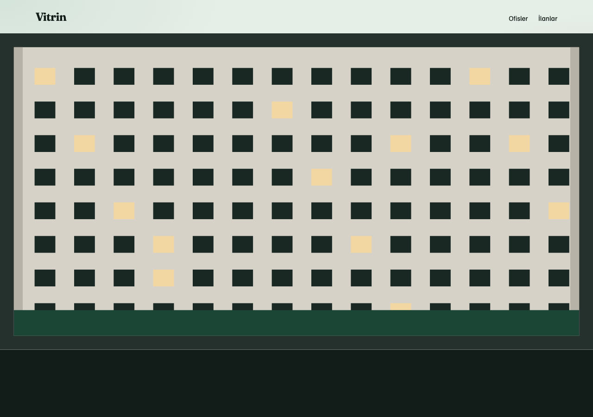

# Vitrin

Ofislerin kendi daire sayfası. Liste on bir ofisi gösterir. Bir ofise girince tanıtım metni ve ilanları durur. İlanlar tarayıcıda saklanır.




## Kurulum

```bash
cd vitrin
python3 -m http.server 8080
```

Aç: http://127.0.0.1:8080

Adresler hash ile değişir:

- `#/` ofisler
- `#/ilanlar` bütün daireler
- `#/ofis/sener` bir ofis

## Nasıl kuruldu

Tek `index.html`, `styles.css` ve `app.js`. Yönlendirme `location.hash` okunarak yapılır; sayfa yenilenmez. Yazı tipleri **Fraunces** ve **Familjen Grotesk**. Ofis kimlikleri betiğin başındaki dizidedir. İlan ve tanıtım metni `localStorage` içine yazılır, bu yüzden her tarayıcı kendi vitrinini görür.
